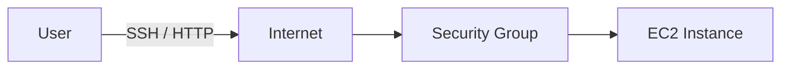

# 01. EC2 インスタンスを作成する

## 目的

AWS 上に仮想サーバーである EC2 インスタンスを 1 台作成し、以降の SSH 接続や Apache 公開の土台にする。

## 前提

- AWS アカウントを作成済み
- ルートユーザーに MFA を設定済み
- 学習用リージョンを 1 つ決めている
- AWS Budgets を設定済み、またはこのあと設定する

## 手順

1. AWS マネジメントコンソールで EC2 を開く
2. 「インスタンスを起動」を選ぶ
3. 名前を `aws-learning-lab-ec2` のように設定する
4. AMI は Amazon Linux 系を選ぶ
5. インスタンスタイプは無料利用枠や低コストのものを選ぶ
6. キーペアを作成または既存のものを選ぶ
7. セキュリティグループは最小限のインバウンドルールにする
8. ストレージサイズを確認する
9. 起動する
10. インスタンス ID、パブリック IPv4、作成したリージョンをメモする

## 概念理解

EC2 は AWS 上で借りる仮想サーバーです。インスタンスタイプは CPU・メモリなどの性能を決め、AMI は OS や初期状態を決めます。キーペアは SSH 接続に使う認証情報で、セキュリティグループは仮想ファイアウォールとして通信の入口を制御します。

## つまずいた点

- AMI、インスタンスタイプ、キーペア、セキュリティグループの関係が最初は分かりにくい
- 無料利用枠の対象でも、条件を外れると課金される可能性がある
- リージョンを間違えると、作ったはずのインスタンスが見つからない

## セキュリティ上の注意

- 秘密鍵は GitHub にアップロードしない
- SSH のインバウンドは自分の IP に絞る
- 使わないポートは開けない
- ルートユーザーの日常利用は避ける

## 削除・課金対策

- 学習後はインスタンスを停止または終了する
- 停止中でも EBS ボリュームには課金される場合がある
- Elastic IP を割り当てた場合、未使用状態で課金される可能性がある
- AMI やスナップショットを作った場合は別途削除が必要

## 構成図

## 学び

- EC2 作成時は「あとで消すもの」を同時に意識する
- セキュリティグループはサーバーの入口として考えると理解しやすい

## 試行ログ

### 2026-06-09

- やったこと:
- 起きたこと:
- 原因:
- 対応:
- 次に確認すること:
