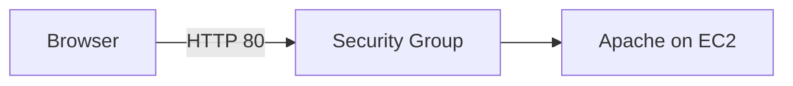

# 03. Apache で HTTP 公開する

## 目的

EC2 上に Apache をインストールし、ブラウザから HTTP でアクセスできる状態にする。

## 前提

- EC2 に SSH 接続できる
- セキュリティグループを編集できる
- 学習用の検証であり、本番公開ではない

## 手順

1. EC2 に SSH 接続する
2. パッケージを更新する
3. Apache をインストールする
4. Apache を起動する
5. 自動起動を有効化する
6. セキュリティグループで HTTP の 80 番ポートを許可する
7. ブラウザで `http://<public-ip>` にアクセスする
8. 確認後、公開範囲を見直す

## コマンド例

```sh
sudo dnf update -y
sudo dnf install -y httpd
sudo systemctl start httpd
sudo systemctl enable httpd
sudo systemctl status httpd
```

## 概念理解

Apache は Web サーバーです。EC2 内で Apache が 80 番ポートを待ち受け、セキュリティグループで 80 番ポートを許可すると、外部のブラウザから HTTP でアクセスできます。

## つまずいた点

- Apache が起動していても、セキュリティグループで 80 番が閉じているとアクセスできない
- HTTPS ではなく HTTP なので、通信は暗号化されない
- パブリック IP はインスタンスを停止・起動すると変わることがある

## セキュリティ上の注意

- HTTP 公開は検証目的に限定する
- 管理画面や秘密情報を置かない
- 不要になったら 80 番ポートを閉じる
- 本番では HTTPS、ログ監視、WAF、パッチ運用などを検討する

## 削除・課金対策

- 検証後は Apache を停止するか、EC2 を終了する
- Elastic IP を使っている場合は未使用課金に注意する
- EBS、AMI、スナップショットの残存を確認する

## 構成図



## 学び

- Web 公開は「サーバー内の待ち受け」と「AWS 側の許可」の両方が必要
- 表示できたあとに閉じるところまでが学習手順

## 試行ログ

### 2026-06-09

- やったこと:
- 起きたこと:
- 原因:
- 対応:
- 次に確認すること:
